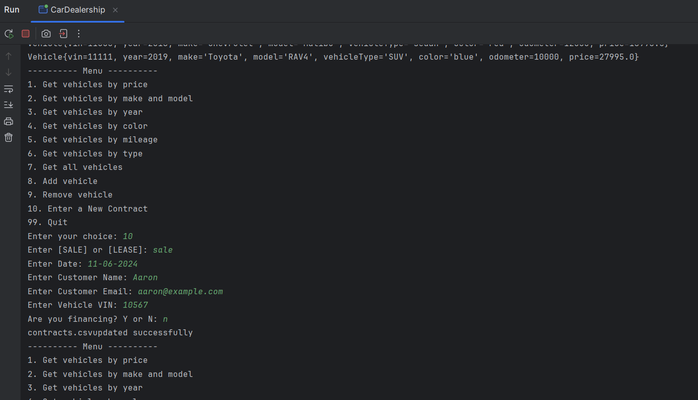

# ADV-Dealership-Project

## Description of the Project

This is an update to the Car Dealership program, where users are able to purchase or lease a vehicle from the dealership. When purchasing, you can also choose whether or not to finance. The contracts.csv file holds the data of contracts that have been written.

## User Stories

- As a user, I want to be able to input my data, so that the application can process it accordingly.
- As a user, I want to receive immediate feedback, so I can understand what to do next.

## Setup

Instructions on how to set up and run the project using IntelliJ IDEA.

### Prerequisites

- IntelliJ IDEA: Ensure you have IntelliJ IDEA installed, which you can download from [here](https://www.jetbrains.com/idea/download/).
- Java SDK: Make sure Java SDK is installed and configured in IntelliJ.

### Running the Application in IntelliJ

Follow these steps to get your application running within IntelliJ IDEA:

1. Open IntelliJ IDEA.
2. Select "Open" and navigate to the directory where you cloned or downloaded the project.
3. After the project opens, wait for IntelliJ to index the files and set up the project.
4. Find the main class with the `public static void main(String[] args)` method.
5. Right-click on the file and select 'Run 'CarDealership.main()'' to start the application.

## Technologies Used

- Java: JDK 17

## Demo

### **Purchasing A Vehicle**

### **Catching Lease Exception**

### **Contract Updated After Purchase**

## Future Work

Future work to be implemented

- Whatever Raymond bestows upon ye.

## Resources

- Stack Overflow
- w3schools

## Thanks

- Thank you to [***Raymond***] for continuous support and guidance.
- Thank you to my classmates who keep me from ripping my hair out in frustration.